# EDC Financial Market Data Connector - Project Overview

## Introduction

This project is a **minimal proof-of-concept (PoC)** demonstrating how to use the **Eclipse Dataspace Components (EDC)** framework to share financial market data securely between organizations.

### What is EDC?

Eclipse Dataspace Components (EDC) is an open-source framework that enables **sovereign data exchange** between organizations. Think of it as a secure, standardized way for companies to share data while maintaining control over who can access it and under what conditions.

**Key Concepts:**
- **Data Sovereignty**: The data owner maintains full control over their data
- **Policy-Based Access**: Rules define who can access data and how they can use it
- **Connector Architecture**: Each organization runs their own connector that manages data sharing

### What Does This Project Do?

This PoC simulates a financial data provider (like Bloomberg or Reuters) sharing market data with authorized clients:

1. **Publishes financial market data** as a data asset (equity price feed for Q1 2025)
2. **Defines access policies** that restrict usage (research only, no redistribution)
3. **Creates contracts** that bind policies to data assets
4. **Exposes APIs** for clients to discover and access the data

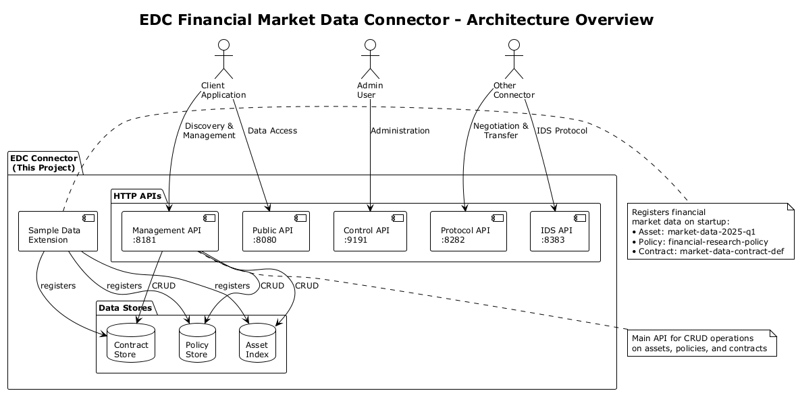
*High-level view of the EDC connector architecture*

---

## Core Concepts Explained

### 1. Assets

An **Asset** represents a data resource that can be shared. In this project, we have:

- **Asset ID**: `market-data-2025-q1`
- **Name**: Equity Price Feed - Q1 2025
- **Description**: Real-time equity prices with 15-minute delay
- **Content Type**: JSON data
- **Base URL**: Where the actual data is hosted

**Think of it as:** A catalog entry describing what data is available.

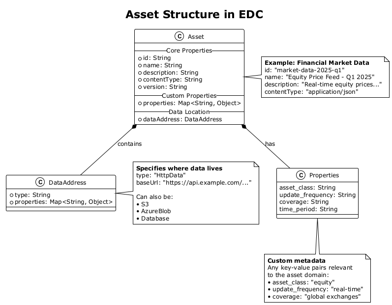
*How assets are structured in EDC*

### 2. Policies

A **Policy** defines the rules for data access and usage. Our financial data policy includes:

- **Policy ID**: `financial-research-policy`
- **Permissions**: Read access only
- **Constraints**:
  - Purpose: Research use only
  - Prohibition: No data redistribution allowed
  - Duty: Data must be deleted after 12 months

**Think of it as:** A legal contract that defines terms of use.

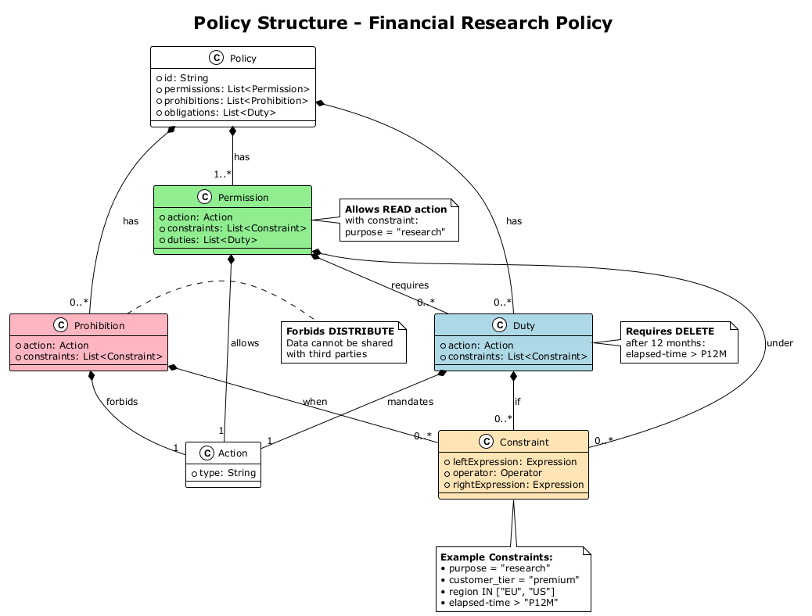
*Policy definition with permissions, constraints, and duties*

### 3. Contract Definitions

A **Contract Definition** links assets to policies. It says "if you want to access this asset, you must agree to these policy terms."

- **Contract ID**: `market-data-contract-def`
- **Links**: `market-data-2025-q1` asset → `financial-research-policy`
- **Access Policy**: Who can see this contract (currently: everyone)
- **Contract Policy**: Terms that must be accepted to use the data

**Think of it as:** A binding agreement that connects data to usage rules.

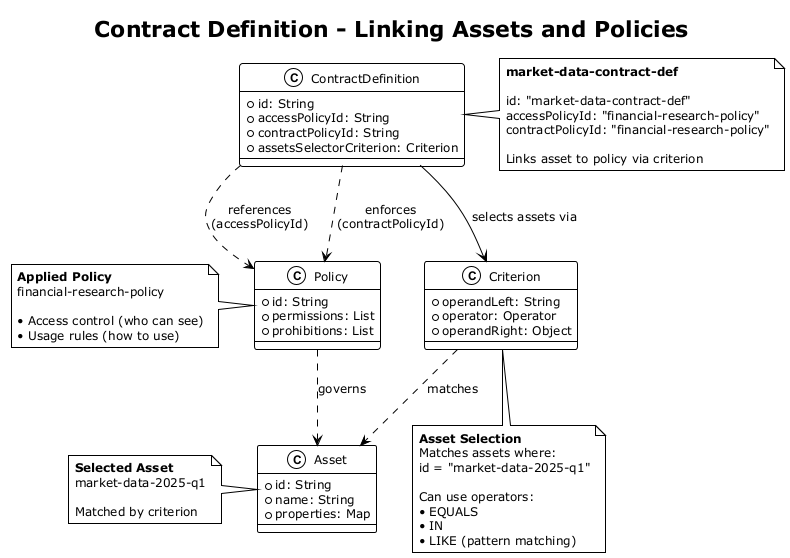
*How contracts link assets and policies*

### 4. The Connector

The **EDC Connector** is the runtime application that:
- Hosts and manages all assets, policies, and contracts
- Exposes HTTP APIs for clients to interact with
- Enforces policy rules during data access
- Handles the negotiation and transfer protocols

**Think of it as:** A secure gateway that controls all data sharing operations.

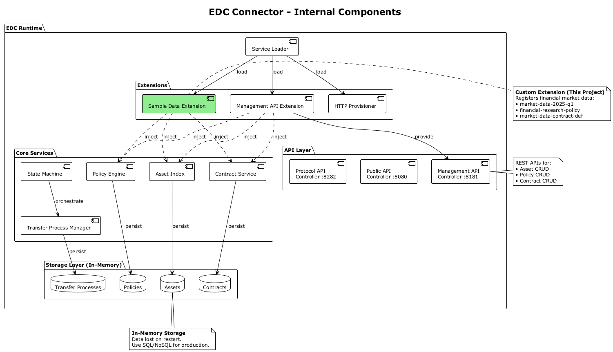
*Internal components of the EDC connector*

---

## Project Architecture

### Component Overview

```
┌───────────────────────────────────────────────────────────────┐
│                EDC Connector (This Project)                   │
├───────────────────────────────────────────────────────────────┤
│                                                               │
│  ┌─────────────────────────────────────────────────────────┐  │
│  │               SampleDataExtension.java                  │  │
│  │            (Registers financial market data)            │  │
│  └─────────────────────────────────────────────────────────┘  │
│                            │                                  │
│                            ▼                                  │
│  ┌─────────────────┐  ┌─────────────────┐  ┌───────────────┐  │
│  │   AssetIndex    │  │   PolicyStore   │  │ ContractStore │  │
│  │   (In-Memory)   │  │   (In-Memory)   │  │  (In-Memory)  │  │
│  └─────────────────┘  └─────────────────┘  └───────────────┘  │
│                                                               │
├───────────────────────────────────────────────────────────────┤
│                         HTTP APIs                             │
├───────────────────────────────────────────────────────────────┤
│  • Management API (8181)  - CRUD operations                   │
│  • Public API (8080)      - Data access                       │
│  • Protocol API (8282)    - Connector-to-connector            │
│  • IDS API (8383)         - IDS protocol support              │
│  • Control API (9191)     - Admin operations                  │
└───────────────────────────────────────────────────────────────┘
```

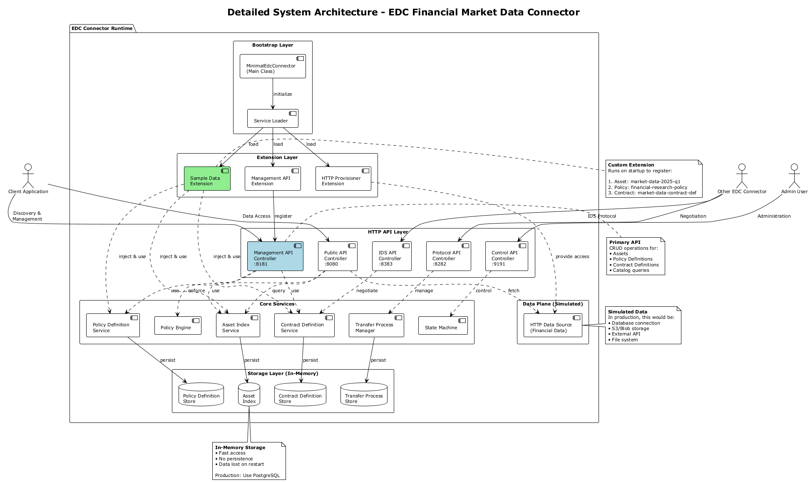
*Complete system architecture with all components*

### Data Flow

1. **Startup**: Connector starts, `SampleDataExtension` registers financial data
2. **Discovery**: Client queries Management API to discover available assets
3. **Policy Review**: Client retrieves policy terms for the asset
4. **Contract Check**: Client verifies contract definition links asset to policy
5. **Access**: Client uses appropriate API to access the data (contract negotiation in full implementation)

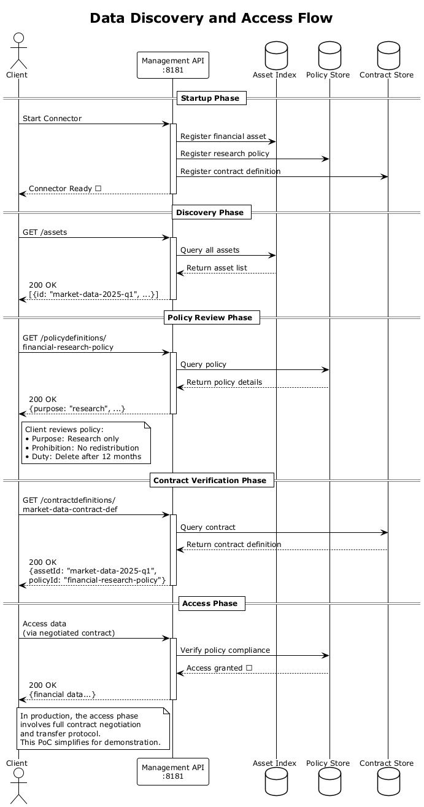
*Step-by-step sequence of data discovery and access*

---

## Key Files Explained

### 1. `src/main/java/com/example/edc/MinimalEdcConnector.java`

**Purpose**: The main entry point that starts the EDC connector.

**What it does:**
- Initializes the EDC runtime with required configuration
- Loads extensions (including our `SampleDataExtension`)
- Starts all HTTP APIs
- Keeps the connector running

**Analogy**: Like pressing the "ON" button for the entire system.

### 2. `src/main/java/com/example/edc/extension/SampleDataExtension.java`

**Purpose**: An EDC extension that populates the connector with sample financial data.

**What it does:**
```java
// Creates the asset
Asset financialAsset = Asset.Builder.newInstance()
    .id("market-data-2025-q1")
    .name("Equity Price Feed - Q1 2025")
    .contentType("application/json")
    .build();

// Defines the policy
Policy policy = Policy.Builder.newInstance()
    .permission(Permission.Builder.newInstance()
        .action(Action.Builder.newInstance().type("USE").build())
        .constraint(Constraint.Builder.newInstance()
            .leftExpression(new LiteralExpression("purpose"))
            .operator(Operator.EQ)
            .rightExpression(new LiteralExpression("research"))
            .build())
        .build())
    .build();

// Links them with a contract
ContractDefinition contract = ContractDefinition.Builder.newInstance()
    .id("market-data-contract-def")
    .accessPolicyId("financial-research-policy")
    .contractPolicyId("financial-research-policy")
    .assetsSelectorCriterion(criterion)
    .build();
```

**Analogy**: Like a librarian cataloging books when the library opens.

### 3. `src/test/java/com/example/edc/EdcManagementApiIT.java`

**Purpose**: Integration tests that verify the connector works correctly.

**What it tests:**
- ✅ Connector responds to health checks
- ✅ Assets can be retrieved via API
- ✅ Policies can be retrieved via API
- ✅ Contract definitions link correctly
- ✅ New assets can be created
- ✅ Error handling works (404 for non-existent assets)

**How to run**: `mvn verify` (requires running connector)

**Analogy**: Like a quality inspector checking every feature before product release.

### 4. `pom.xml`

**Purpose**: Maven build configuration that defines project dependencies.

**Key Dependencies:**
- **EDC Framework** (v0.8.1): Core connector functionality
- **Management API**: REST APIs for asset/policy/contract management
- **JUnit 5**: Testing framework

**Build Configuration:**
- Regular build: `mvn clean package` (skips tests, 5 seconds)
- With integration tests: `mvn verify` (runs all tests, ~6 seconds)

---

## How to Use This Project

### Prerequisites

- **Java 17** or higher
- **Maven 3.8+**
- **PowerShell** (for testing scripts)
- **curl** or any HTTP client (optional, for manual testing)

### Quick Start

#### 1. Build the Project

```bash
mvn clean package
```

This compiles the code and creates an executable JAR file in the `target/` directory.

#### 2. Start the Connector

```bash
java -jar target/edc-minimal-poc-1.0.0.jar
```

You should see log output indicating:
- ✅ Financial market data registered
- ✅ HTTP APIs started on ports 8080, 8181, 8282, 8383, 9191

#### 3. Test the APIs

**Option A: PowerShell Script** (Automated)
```powershell
.\test-api.ps1
```

**Option B: Manual Testing**
```bash
# Get the financial asset
curl http://localhost:8181/management/v3/assets/market-data-2025-q1

# Get the policy
curl http://localhost:8181/management/v3/policydefinitions/financial-research-policy

# Get the contract definition
curl http://localhost:8181/management/v3/contractdefinitions/market-data-contract-def
```

#### 4. Run Integration Tests

```bash
mvn verify
```

This runs all 6 integration tests to verify the connector works correctly.

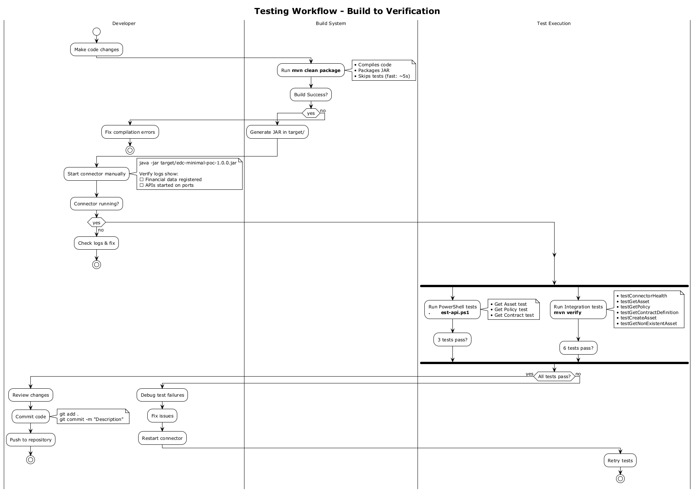
*Complete testing workflow from build to verification*

---

## API Reference

### Management API (Port 8181)

| Endpoint | Method | Description |
|----------|--------|-------------|
| `/management/v3/assets` | GET | List all assets |
| `/management/v3/assets/{id}` | GET | Get specific asset |
| `/management/v3/assets` | POST | Create new asset |
| `/management/v3/policydefinitions` | GET | List all policies |
| `/management/v3/policydefinitions/{id}` | GET | Get specific policy |
| `/management/v3/contractdefinitions` | GET | List all contracts |
| `/management/v3/contractdefinitions/{id}` | GET | Get specific contract |

### Example Requests

**Get Asset:**
```bash
curl -X GET http://localhost:8181/management/v3/assets/market-data-2025-q1 \
  -H "Content-Type: application/json"
```

**Create Asset:**
```bash
curl -X POST http://localhost:8181/management/v3/assets \
  -H "Content-Type: application/json" \
  -d '{
    "@context": {"@vocab": "https://w3id.org/edc/v0.0.1/ns/"},
    "@id": "my-asset-123",
    "properties": {
      "name": "My Financial Data",
      "contenttype": "application/json"
    }
  }'
```

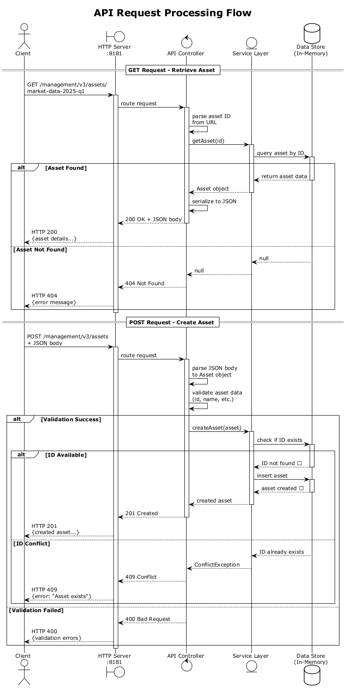
*How API requests are processed by the connector*

---

## Understanding the Financial Data Domain

### Why Financial Market Data?

This project uses financial market data as a realistic example of data that:
- Has **high value** and requires protection
- Needs **usage restrictions** (research only, no redistribution)
- Requires **compliance** with data retention policies
- Benefits from **controlled sharing** between organizations

### Sample Data Structure

The asset represents equity price data with this structure:

```json
{
  "asset_id": "market-data-2025-q1",
  "name": "Equity Price Feed - Q1 2025",
  "description": "Real-time equity prices with 15-minute delay",
  "data_format": "JSON",
  "update_frequency": "Real-time (15-min delay)",
  "coverage": "Major global exchanges",
  "time_period": "Q1 2025 (Jan-Mar)",
  "sample_securities": [
    "AAPL", "GOOGL", "MSFT", "AMZN", "TSLA"
  ]
}
```

### Policy Constraints Explained

**Purpose Constraint: "research"**
- Data can only be used for internal research and analysis
- Cannot be used for production trading systems
- Cannot be shared with third parties

**Prohibition: "distribute"**
- Raw data cannot be redistributed to other parties
- Derived insights can be shared, but not source data
- Prevents unauthorized data resale

**Duty: "delete after 12 months"**
- Data must be purged after retention period
- Ensures compliance with data licensing agreements
- Reduces long-term storage costs

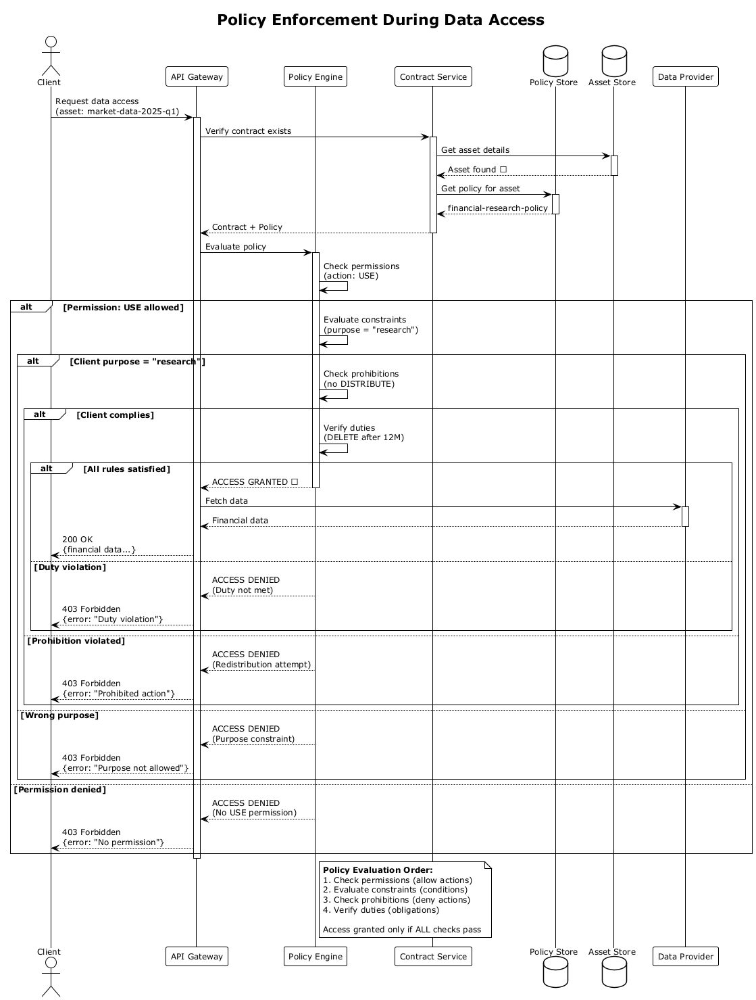
*How policies are enforced during data access*

---

## Extending This Project

### Adding New Assets

To add more financial data assets, modify `SampleDataExtension.java`:

```java
// Add a new asset for bond data
Asset bondAsset = Asset.Builder.newInstance()
    .id("bond-data-2025-q1")
    .name("Corporate Bond Prices - Q1 2025")
    .contentType("application/json")
    .property("type", "bonds")
    .property("asset_class", "fixed-income")
    .dataAddress(DataAddress.Builder.newInstance()
        .type("HttpData")
        .property("baseUrl", "https://api.example.com/bonds")
        .build())
    .build();

assetIndex.create(bondAsset);
```

### Creating Custom Policies

```java
// Create a more restrictive policy for premium data
Policy premiumPolicy = Policy.Builder.newInstance()
    .permission(Permission.Builder.newInstance()
        .action(Action.Builder.newInstance().type("USE").build())
        .constraint(Constraint.Builder.newInstance()
            .leftExpression(new LiteralExpression("customer_tier"))
            .operator(Operator.EQ)
            .rightExpression(new LiteralExpression("premium"))
            .build())
        .duty(Duty.Builder.newInstance()
            .action(Action.Builder.newInstance().type("DELETE").build())
            .constraint(Constraint.Builder.newInstance()
                .leftExpression(new LiteralExpression("elapsed-time"))
                .operator(Operator.GT)
                .rightExpression(new LiteralExpression("P6M")) // 6 months
                .build())
            .build())
        .build())
    .build();
```

### Adding New API Endpoints

EDC is modular - you can add extensions for:
- Custom authentication (OAuth2, API keys)
- Additional protocols (OData, GraphQL)
- Monitoring and observability (Prometheus, OpenTelemetry)
- Persistent storage (PostgreSQL, MongoDB)

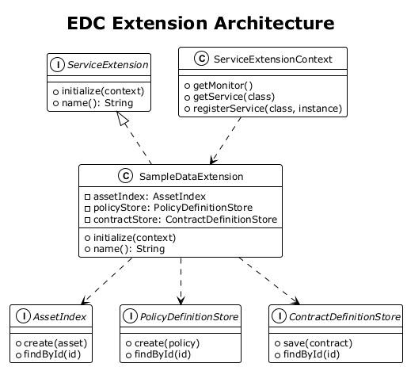
*How to add custom extensions to EDC*

---

## Troubleshooting

### Common Issues

**1. Port Already in Use**
```
Error: Address already in use: bind
```
**Solution**: Stop any running connectors or change port configuration.

**2. Java Version Mismatch**
```
Error: Unsupported class file major version
```
**Solution**: Ensure Java 17 or higher is installed (`java -version`).

**3. Tests Fail - Connector Not Running**
```
Connection refused: connect
```
**Solution**: Start the connector before running integration tests.

**4. Asset Not Found**
```
HTTP 404: Asset 'market-data-2025-q1' not found
```
**Solution**: Check connector logs to verify `SampleDataExtension` executed successfully.

### Debug Tips

**Enable Verbose Logging:**
```bash
java -Dedc.log.level=DEBUG -jar target/edc-minimal-poc-1.0.0.jar
```

**Check API Availability:**
```bash
curl http://localhost:8181/management/v3/assets
```

**Verify Build Success:**
```bash
mvn clean package -X  # Maven debug output
```

---

## Next Steps

### Learning Path

1. **Understand the Basics** (You are here!)
   - Read this document thoroughly
   - Run the quick start guide
   - Experiment with the APIs

2. **Explore EDC Documentation**
   - [Official EDC Documentation](https://eclipse-edc.github.io/docs/)
   - [EDC Samples Repository](https://github.com/eclipse-edc/Samples)
   - [Dataspace Protocol Specification](https://docs.internationaldataspaces.org/)

3. **Build Multi-Connector Scenarios**
   - Run two connectors locally
   - Implement contract negotiation
   - Transfer data between connectors

4. **Add Production Features**
   - Persistent storage (replace in-memory stores)
   - Authentication and authorization
   - TLS/HTTPS for secure communication
   - Monitoring and alerting

### Production Considerations

This PoC uses **in-memory storage** - all data is lost when the connector stops. For production:

- **Replace with persistent storage**: PostgreSQL, Azure CosmosDB, etc.
- **Add authentication**: OAuth2, client certificates, API keys
- **Enable HTTPS**: All APIs should use TLS encryption
- **Implement monitoring**: Health checks, metrics, distributed tracing
- **Add backup/recovery**: Database backups, disaster recovery plans
- **Scale horizontally**: Load balancing, container orchestration (Kubernetes)

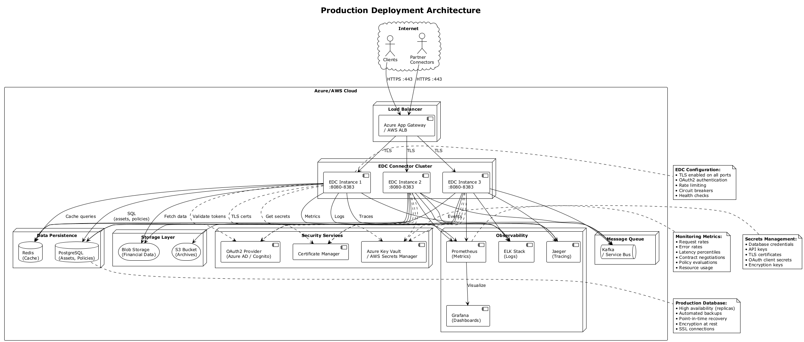
*Example production deployment with persistence and security*

---

## Glossary

| Term | Definition |
|------|------------|
| **Asset** | A data resource that can be shared (file, API, database) |
| **Connector** | An EDC instance that manages data sharing for one organization |
| **Contract Definition** | Links assets to policies, creating enforceable agreements |
| **Dataspace** | A network of connectors that share data under common rules |
| **EDC** | Eclipse Dataspace Components - the framework used in this project |
| **Extension** | A modular component that adds functionality to EDC |
| **IDS** | International Data Spaces - a reference architecture for dataspaces |
| **Policy** | Rules that govern how data can be accessed and used |
| **Transfer** | The process of moving data from provider to consumer |

---

## References

- [Eclipse Dataspace Components GitHub](https://github.com/eclipse-edc/Connector)
- [EDC Documentation](https://eclipse-edc.github.io/docs/)
- [Dataspace Protocol](https://docs.internationaldataspaces.org/)
- [International Data Spaces Association](https://internationaldataspaces.org/)
- [GAIA-X Framework](https://www.gaia-x.eu/)

---

## Contributing

This is a learning project. Feel free to:
- Add more sample data domains (healthcare, IoT, logistics)
- Implement additional policy constraints
- Create visualization tools
- Improve documentation
- Add more comprehensive tests

---

## License

This project uses the Eclipse Dataspace Components, which is licensed under the Apache License 2.0.

---

**Questions?** Review the [QUICKSTART.md](../QUICKSTART.md) and [COMMANDS.md](../COMMANDS.md) for detailed commands and workflows.
